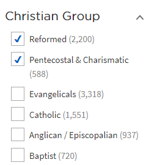

# userscripts

## Instructions

Below are extesions for your browser to enhance your browsing experience on various websites.

To use these extensions:

1. Install [Tampermonkey](https://www.tampermonkey.net/)
2. Click on any of the "Install with Tampermonkey" links below.

## Faithlife Community Forum Search2G

Redirects searches on the forums to Google.

- Press Enter or click the search button to search the forums using Google.
- Press Ctrl-Enter or Ctrl-Click the search button to search Logos Support, Logos Wiki, and the forums using Google.
- Press Shift-Enter or Shift-Click the search button to search the forums using the default forum search.

Additionally, Alt-S will activate the search box so you can enter your search.

You can also find this script on [OpenUserJS](https://openuserjs.org/scripts/simsrw73/Faithlife_Community_Forum_Search2G).

### See Also
 - [A low contrast, modern theme for the Faithlife Community Forums](https://github.com/simsrw73/white-off)

## Faithlife Stores Enhanced

Enhancements for Faithlife stores: logos.com, verbum.com, ebooks.faithlife.com, ebooks.noet.com

- Adds extended information about the resource beneath the resource image. This includes the Resource ID and the current version of the resource. Hovering over the button shows the Milestone Indexes available in the resource. Additionally, clicking on the info button will open the resouce in app.logos.com.
- Adds page navigation to the sidebar. No extra click to access the navigation--just hover over the Navigate button to open a menu of section headers. Select a header to scroll smoothly to that section of the page.
- Adds Share-To social icons for sharing the resource to Faithlife, Facebook, and Twitter. Where applicable it will share an image of the resource, the title, and allow for you to enter a message.
- Removes Live Chat window. You can initiate chat from the Support menu.
- Reformatted checkboxes

